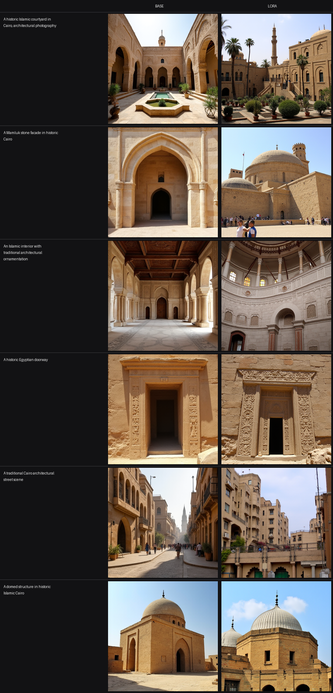

# ArchForge — Evaluation

Base-model vs LoRA comparison for Mamluk / Islamic Cairo architectural style adaptation.

> **Status:** complete. Dataset, training and the base-vs-LoRA comparison all ran to
> completion; §4 and §5 report what was observed, including the failure cases.
> §5.5 records a methodological weakness in how the adapter was trained — it is stated
> rather than corrected, and should be read before any quantitative claim is made.

---

## 1. Objective and time-box constraint

Demonstrate an end-to-end architectural style-adaptation workflow — dataset curation,
structured captioning, LoRA training, controlled evaluation — inside a **5-hour
wall-clock budget** on **Colab free tier (Tesla T4, 16GB VRAM)**.

This is a proof of concept, not a production model. The scope was kept deliberately
small: 39 images, not thousands; a few hundred steps, not thousands; six evaluation
prompts, not a benchmark suite. Quality-per-hour was the constraint, and the honest
account of what did not work is part of the deliverable.

**Hardware ceiling:** T4, sm_75, ~15GB usable VRAM. This is not a soft constraint —
it eliminates FP8 entirely, makes bf16 2–4× slow, and rules out training the
transformer without quantisation.

## 2. Dataset

| | |
|---|---|
| Images | **39** (33 train / 6 validation, 85/15, seeded at 0) |
| Resolution | 512×512 PNG, centre-cropped and resized |
| Source | Wikimedia Commons, via the MediaWiki API |
| Licensing | Per-image, recorded — no image without a checkable licence |

**Licence breakdown** (recorded per image in `metadata.csv`):

| Licence | Images |
|---|---|
| CC BY-SA 4.0 | 14 |
| CC BY-SA 3.0 | 14 |
| CC BY 3.0 | 4 |
| CC BY-SA 2.0 | 3 |
| CC BY 2.0 | 2 |
| Public domain | 1 |
| No known restrictions | 1 |

All licences are permissive with attribution. Most are share-alike, which is a real
obligation on reuse and is carried forward in the dataset card.

### Curation was mostly rejection

**123 candidates were collected and every one was inspected visually.** 39 were kept.
The failure modes are worth stating because they are the actual work:

- **Wrong country.** Wikimedia categories are indexed by vocabulary, not geography.
  `Category:Mashrabiya` returned a Portuguese colonial townhouse; `Category:Bab al-Futuh`
  returned a fort in Delhi; other pulls produced Agra, Aleppo and the Armenian Quarter.
- **Not a photograph.** 19th-century lithographs (David Roberts), an orientalist
  painting by John Frederick Lewis, an 1878 archival reproduction, a book scan,
  and an architectural plan drawing.
- **Modern architecture.** A 20th-century apartment block (with a visible air-conditioning
  unit), a modern mosque with no Mamluk vocabulary, a construction crane, a night shot
  dominated by LED light trails, a cityscape with a traffic roundabout.
- **Museum objects.** Mashrabiya screens photographed as artefacts on a wall rather
  than in situ.

Every rejection is recorded with its reason in `data/exclusions.csv`; the kept set is
the explicit allowlist in `data/selected.csv`. This matters more than it sounds: a
denylist would silently admit new junk on any re-run, whereas an allowlist cannot.

Two rejections came from direct human review rather than my own pass, and are recorded
as such.

### Quality control

Corrupted-file drop, perceptual-hash deduplication (64-bit pHash, Hamming ≤ 10),
resolution floor, centre-crop to 512, deterministic split.

Deduplication removed **0 duplicates**. That was verified rather than assumed, because
a dedup step that silently does nothing looks identical to a clean dataset: a
JPEG-recompressed copy of an image hashes at distance 0, and genuinely different
images at distance ≥ 16.

## 3. Training configuration

| | |
|---|---|
| Base model | `black-forest-labs/FLUX.1-dev` |
| Method | LoRA on transformer attention layers only (`to_k`, `to_q`, `to_v`, `to_out.0`) |
| Base quantisation | NF4 (bitsandbytes), 4-bit |
| Resolution | 512 |
| Rank / alpha | 8 / 8 |
| Precision | fp16 + GradScaler |
| Optimizer | 8-bit AdamW |
| Learning rate | 1e-4, constant schedule, 0 warmup |
| Batch size | 1, gradient accumulation 4 |
| Gradient checkpointing | enabled |
| Text embeddings | pre-cached, T5 unloaded before training |
| Hardware | Colab free tier, Tesla T4, 16GB |
| Steps | 400 |
| Wall clock | ≈2 h 04 m (≈18.6 s/step, checkpoint writes included) |

### Configuration constraints, and why

Three findings were verified against primary sources before spending GPU time, and
each contradicts an assumption worth stating:

1. **ai-toolkit cannot train FLUX on a T4.** Its FAQ specifies 24GB minimum, it ships
   no NF4 quantiser, and its default `qfloat8` is FP8 — unaccelerated below sm_89.
   The project brief listed ai-toolkit as *preferred* and diffusers as *fallback*;
   on this hardware that ordering is inverted, and the fallback is the only path.
2. **The stock diffusers FLUX DreamBooth LoRA script has no quantisation support.**
   A 23.8GB fp16 transformer cannot train on 16GB, and there is no flag to change that.
   The usable script is the research-project
   `train_dreambooth_lora_flux_miniature.py`, which hardcodes NF4.
3. **T5-XXL fp16 (9.5GB) + NF4 transformer (6.7GB) exceeds 16GB** before LoRA
   parameters, optimizer state or activations. Text-embedding pre-caching is therefore
   mandatory, not an optimisation.

Also confirmed: FP8 requires sm_89+ (impossible on sm_75); the T4 has no native bf16,
and emulated bf16 is 2–4× slow, so training is fp16; Flash Attention requires sm_80+
and fails at kernel launch on Turing even though the wheel imports cleanly — diffusers'
default SDPA backend is used instead and `flash-attn` is deliberately not installed.

Both demo scripts in that research project are hardcoded to the `Norod78/Yarn-art-style`
dataset and load images from it rather than from disk, so `scripts/patch_diffusers.py`
redirects them to a local dataset built from these 39 images.

## 4. Base vs LoRA comparison

Six fixed prompts, identical seeds, steps, guidance scale and resolution across both
runs. Only the adapter differs — that is what makes it controlled.



| # | Prompt | Observation |
|---|---|---|
| 1 | A historic Islamic courtyard in Cairo, architectural photography | Base gives a symmetrical arcaded courtyard around a central fountain — clean but generic. LoRA adds a slender Cairene minaret, denser carved stone and warmer limestone, but the arcade and the minaret rise on conflicting axes, and the balustraded stair at right is foreign to the vocabulary. |
| 2 | A Mamluk stone facade in historic Cairo | Base returns a single monumental pointed-arch portal, clean and period-ambiguous. LoRA reads much closer to a real Cairene funerary complex — domes, a tower, visitors in modern dress — but answers "facade" with a wide complex view, so adherence drops. Crowd figures are unresolved mush. |
| 3 | An Islamic interior with traditional architectural ornamentation | Base is a legible hypostyle hall: coffered ceiling, columns, arcade, tiled floor. LoRA turns it into a curved domed interior with marble revetment and a clerestory. The motifs are more plausibly Mamluk, but the geometry does not close — the columns share no ground plane and the floor merges into the wall. Clearest hallucination in the set. |
| 4 | A historic Egyptian doorway | Both produce a carved stone doorway with relief jambs, so adherence holds. LoRA is more weathered and more intricately carved, but the ornament has no structure — the relief on the right jamb is undifferentiated texture rather than a repeated motif. |
| 5 | A traditional Cairo architectural street scene | Base holds a readable street: receding perspective, mashrabiya windows, a distant minaret. LoRA flattens it into frontally stacked balconies and planting, with weak depth and an unresolved pale mass at right. Reads as a facade collage rather than a street. |
| 6 | A domed structure in historic Islamic Cairo | Strongest LoRA result. Base gives a plain cubic qubba with one dome. LoRA produces a ribbed dome with chevron surface articulation — a genuine Mamluk motif, cf. Qalawun and Barsbay — a second dome behind it, and richer carved stone. A distorted arch at bottom centre fails to resolve. |

Evaluated on five axes: **style fidelity** (does the Mamluk vocabulary appear),
**structural plausibility** (arches, domes, muqarnas, proportions), **style bleeding**
(Gothic / Victorian / Scandinavian / modern minimalist contamination), **hallucination**
(impossible structures), and **prompt adherence**.

## 5. What worked, and what did not

### Worked

- Dataset curation and licence tracking — complete and auditable per image.
- The rejection pipeline: 123 candidates reviewed down to 39, every rejection with a
  recorded reason, wrong-country contamination caught in categories that are indexed
  by vocabulary rather than geography.
- Training converged, and the adapter bound the style. The LoRA shifts every prompt
  toward Cairene limestone with a denser carved surface, and introduces vocabulary the
  base model does not produce: ribbed domes (prompt 6), a slender Cairene minaret
  (prompt 1), Mamluk funerary massing (prompt 2). This is the result the run was for.
- No Western style bleeding. Nothing in the six LoRA outputs reads as Gothic, Victorian,
  Scandinavian or modern minimalist — the failure mode the caption vocabulary was
  designed to prevent did not occur.

### Did not work — honest failure cases

> This section must contain at least one real failure. A report with no failures from
> a 39-image, few-hundred-step run is not credible. Record what actually happened.

**1. Structural coherence degrades as style fidelity rises.** Prompts 3 and 5 are the
clearest cases. Prompt 3 becomes a domed interior whose columns share no ground plane
and whose floor merges into the wall; prompt 5 collapses a street into a frontal
collage. The adapter appears to have learned surface and massing before geometry.

**2. Prompt adherence drops on two of six prompts.** Prompt 2 asks for a facade and
returns a wide complex view; prompt 5 asks for a street and returns a facade. In both,
memorised Mamluk massing appears to have overridden the prompt.

**3. Detail below the motif scale is mush.** Prompt 4's doorway keeps its framing, but
the relief carving is undifferentiated texture — the adapter reproduces the *presence*
of ornament without its repetition structure.

**4. The predicted colour-cast failure partly materialised.** Four of six prompts
(1, 2, 4, 6) shift warmer and more saturated than base, which is the bleeding signature
this section anticipated. Prompts 3 and 5 shift cooler and paler, so it is not a global
cast applied regardless of content. Warm is the default the adapter reaches for, not a
filter it always applies.

**5. The evaluation is not on held-out images.** `metadata.csv` marks 33 images train
and 6 validation, and §2 reports that split. The LoRA was trained on all 39: the
embedding pass reads the published dataset as a single split, so
`compute_embeddings.py` returned 39 rows and training consumed all of them. The six
validation images were therefore seen during training. Because the comparison is driven
by six text prompts rather than by those images, this is style exposure rather than
image memorisation, and no claim above rests on held-out data — but the split stated in
§2 is not reflected in how the adapter was trained, and a quantitative evaluation would
need it respected.

**6. Infrastructure cost dominated model cost.** Most of the wall clock went to
environment failure, not training. `enable_model_cpu_offload()` hangs on a
bitsandbytes-quantized pipeline on this hardware and had to be inverted to opt-in; the
diffusers research scripts target transformers 4.x and broke twice against
transformers 5 (first `load_in_8bit` as a `from_pretrained` kwarg, then bfloat16
embeddings reaching `numpy`); and `diffusers` >=0.40 requires `huggingface_hub` >=1.23,
which Colab does not ship. Training itself was the least eventful part of the run.

**Not tested.** Whether the `mamluk_architecture` trigger token bound to the visual
concept was not isolated. Doing so needs a run with the trigger token removed from the
prompts, which the time box did not allow.

## 6. What a longer run would fix

- **More data.** 39 images is the binding constraint. Several hundred well-captioned
  images across more Mamluk monuments, with interior and detail coverage, is the single
  highest-value change.
- **More steps.** The reference configuration is 700 steps; this run is time-boxed
  well below that. Additional steps with a cosine schedule and warmup would likely
  sharpen style binding.
- **Full-VRAM training.** A 24GB+ GPU removes the NF4 quantisation entirely, which
  removes the dequantisation overhead and the precision loss it introduces — and would
  allow training the text encoders rather than pre-caching embeddings.
- **Better captions.** The VLM base descriptions are unverified beyond spot-checking.
  Human-written captions with deliberate vocabulary variation would likely improve
  generalisation beyond the memorised monuments.

## 7. Reproducing this

```bash
python scripts/collect_dataset.py --per-category 8 --target 130
python scripts/build_dataset.py
python scripts/caption_dataset.py
python scripts/contact_sheet.py
```

Then `ARCHFORGE_COLAB.ipynb` for generation, training and the comparison grid.
The dataset rebuild is deterministic: same allowlist, same seed, same output.
